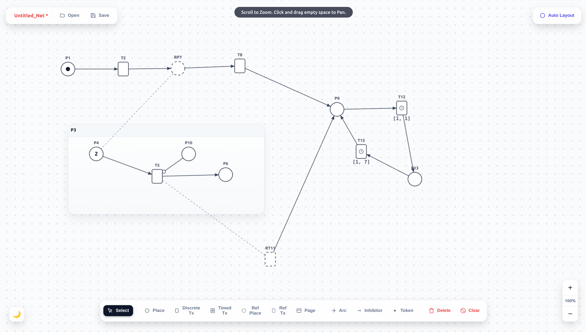

# Petri Net Editor



A lightweight, modern, and fully interactive web-based Petri net editor. Built with a Python/Flask backend and a vanilla HTML5 Canvas frontend, this editor requires no complex database setup and runs lightning-fast right in your browser. 

It supports standard bipartite graph rules, hierarchical pages, discrete & timed transitions, a cyberpunk-inspired dark mode, and seamless client-side PNML import/export.

## Features

* **Modern UX/UI:** Glass-morphic floating toolbars, crisp scalable SVG icons, an infinitely pannable/zoomable dot-grid canvas, and a sleek Dark Mode toggle featuring a stylized Matrix-green and neon-blue aesthetic.
* **Hierarchical Modeling:** Create PNML-compliant "Pages" to group sub-nets. Dragging a page moves all its children, and elements are bounded to their parent containers.
* **Advanced Nodes:** * Standard Places & Discrete Transitions.
  * **Timed Transitions** with a mini-clock visualizer and in-place editable `[start, end]` intervals.
  * **Reference Nodes** (Ref Places / Ref Transitions) with visual dashed-line target linking.
* **Smart Arcs:** Connect nodes using standard Arcs or Inhibitor Arcs. The editor strictly enforces bipartite graph rules (e.g., automatically blocking invalid Place-to-Place or Transition-to-Transition connections).
* **In-Place Editing:** Double-click any label or timing interval on the canvas to spawn a dynamic floating input. Type your changes and press `Enter` to save instantly.
* **Auto-Layout:** A recursive grid-based auto-layout algorithm cleans up messy or imported diagrams instantly.
* **Local Persistency:** Uses the modern Web File System API for silent `Ctrl+S` overwriting, saving standard `.pnml` or `.xml` files straight to your disk without annoying browser download popups.

---

## Installation & Setup

### Prerequisites

You need **Python 3.x** installed on your system.

### 1. Install Dependencies

The backend relies purely on Flask. Install it via pip:
```bash
pip install flask
```

### 2. Project Structure

Ensure your directory looks exactly like this before running:

```
your-repo-folder/
│
├── app.py                 # The Flask backend server
├── image.png              # Screenshot for this README
└── templates/
    └── index.html         # The HTML5 Canvas frontend
```

### 3. Start the Server

Run the Flask application from your terminal:

```
python app.py
```

### 4. Open the Editor
Once the server boots, open your modern web browser (Chrome, Edge, or Firefox) and navigate to:

```
http://localhost:5000
```

## Usage Guide & Shortcuts

### Canvas Controls
* **Pan:** Middle-click and drag (or click and drag empty space with the **Select** tool).
* **Zoom:** Use the **Mouse Wheel** or the **+/-** UI controls in the bottom right.
* **Edit Labels/Time:** Double-click the text of any element to spawn an inline editor. Press **Enter** to save.

---

### Creating Elements
* **Basic Nodes:** Select a tool from the bottom dock (e.g., **Place**, **Discrete Tx**) and click anywhere on the canvas to drop it.
* **Reference Nodes:** Select the **Ref Place** or **Ref Tx** tool, click the canvas to drop it, and follow the dashed line to the standard target node you want to link.

---

### Connecting Nodes
1. Select the **Arc** or **Inhibitor** tool.
2. Click the **source node**.
3. Click the **destination node**. 
> The line will snap perfectly to the perimeters of the shapes.

---

### Keyboard Shortcuts
| Shortcut | Action |
| :--- | :--- |
| **Ctrl + S / Cmd + S** | Silently saves/overwrites the active PNML file (fallback to download on Firefox/Safari). |
| **Backspace / Delete** | Deletes the currently selected element (includes cascading deletes for Pages). |
| **Escape** | Cancels an active inline text edit. |

---

## PNML Compatibility
This editor strictly writes and parses XML adhering to the [PNML 2009 Grammar](http://www.pnml.org/version-2009/grammar/ptnet).

**Extensions:**
Because **Timed Transitions** and **Inhibitor Arcs** fall slightly outside the core base specification, they are serialized gracefully using `<toolspecific>` tags. This references the `de.tudresden.inf.st.pnml.distributedPN` namespace for timing, ensuring compatibility with standard academic evaluation tools.
